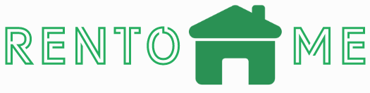
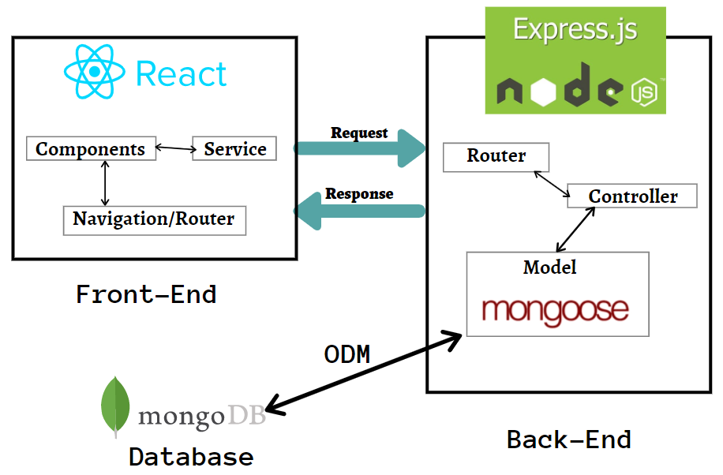

 

# RentoMe MERN web App
 
## Intro
This is a a full stack web app build with MERN stack and 
Rest API in the server side and  with React on the client side. We are saving our data to mongodb database. 


It includes the following:

- Backend Rest API with Express & MongoDB
- JWT authentication middleware
- React client to register, login, logout, 
- React Bootstrap UI library and CSS for styling 

## Usage :wrench:

- Create a MongoDB database and obtain your `MongoDB URI` - [MongoDB Atlas](https://www.mongodb.com/cloud/atlas/register)


### Install Dependencies (client & server)

```
cd server 
npm install
cd client 
npm install
```

### Run

```

# Run client (:3000) & server (:8800)
npm start (npm-run-all)

# Run server only
npm run dev
```

## Build

```
# Create client prod build
cd client
npm run build
```


##  Architecture
 


 ## Acknowledgments
 * [Holberton School](https://www.holbertonschool.com/) (Staff and Students)